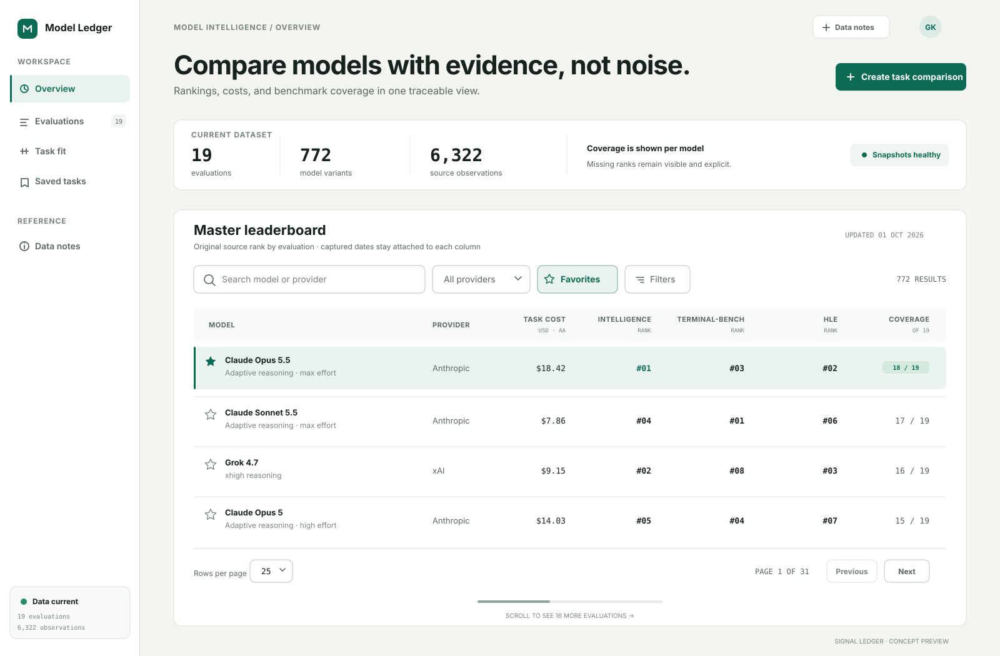

# Signal Ledger

> A light-only product direction for Model Benchmarks. This is a visual reboot: it keeps the product’s comparison, filtering, ranking, favorites, task-planning, and provenance needs while replacing the current styling and layout habits.

## Visual preview

[Open the full-size visual](./visuals/signal-ledger-overview.svg)

The preview uses representative product data to show hierarchy, density, color, control states, and table treatment. It is the approval target for the direction, not a production screen or final component specification.

## 1. Design Direction Name

**Signal Ledger**

The name combines the product’s role as a signal-finding tool with the trust, structure, and traceability of a research ledger.

## 2. Visual Mood

- Calm research workspace with the precision of a professional data tool.
- Warm mineral canvas and crisp white working surfaces rather than a cold SaaS dashboard.
- Editorial hierarchy around evidence, provenance, and comparison.
- Dense where users scan data; spacious where they decide what to do.
- Confident evergreen accents used as signals, not decoration.

## 3. Why This Direction Works

The current UI has useful accessibility foundations, but its hierarchy relies on many similar white cards, small type, repeated blue links, and locally defined spacing. Signal Ledger gives every layer a clear job: the canvas establishes place, the navigation rail establishes orientation, and one wide evidence sheet holds the active workflow. This removes card-on-card clutter and makes the primary data view feel intentional.

The direction fits researchers, developers, and model buyers who need to compare many close options without losing source context. Controls sit directly above the information they affect. Numeric values use tabular figures in the same Geist family as the surrounding table text. Sticky identity columns, visible result counts, capture dates, and quiet provenance labels support trust. The restrained palette also leaves room for benchmark category colors and semantic states without making the interface noisy.

The layout scales across the product: the evidence sheet becomes a leaderboard, a task builder, a saved-task library, or a methodology article. The same toolbar, status strip, and section rhythm can serve every major route.

## 4. Core Design Principles

1. **Evidence leads.** Put ranks, costs, coverage, source, and capture date closer to the decision; keep promotional copy brief.
2. **One task, one working surface.** Use a single dominant sheet per page. Create inset regions only when they clarify a step, state, or relationship.
3. **Dense data, generous framing.** Tables stay compact; page titles, summaries, and workflow boundaries get more space.
4. **Accent communicates action or state.** Evergreen marks primary actions, current navigation, selected rows, links, and focus. It is never used as filler.
5. **Keep context visible.** Preserve headers, model identity, active filters, result counts, and save state while users scan or scroll.
6. **Accessibility is visual quality.** Maintain strong contrast, 40–44px controls, visible focus, text labels for icons, and state cues beyond color.

## 5. Visual Language Rules

- **Spacing density:** Use a 4px base scale. Page gaps are 32–48px, surface padding is 24–32px, control gaps are 8–12px, and table rows are 48–52px. Mobile gutters are 16px.
- **Surface treatment:** Use a warm mineral page canvas, white working sheets, and a pale sage inset for selected or explanatory areas. Avoid nesting multiple bordered cards.
- **Borders and shadows:** Use 1px neutral borders for structure. Reserve a soft shadow for floating menus and dialogs; normal sheets and cards remain flat.
- **Radius feel:** 12px for major sheets, 8px for controls and small interactive surfaces, 6px for compact tags. Pills are reserved for status or removable filters.
- **Typography feel:** Use Geist for a crisp, modern UI, including ranks, costs, percentages, dates, and review comparisons. Use tabular figures when values need alignment. Headings are sentence case with tight tracking; labels are concise and medium weight.
- **Color usage:** Keep roughly 85% of the screen neutral. Evergreen is the single brand/action color. Amber, red, and blue appear only for warning, error, and information states. Benchmark colors stay small and data-specific.
- **Iconography:** Use simple 18px outline icons with a consistent 1.75px stroke. Pair unfamiliar icons with text; never use emoji as interface icons.
- **Motion:** Use 120–180ms ease-out transitions for hover, selection, disclosure, and route feedback. Avoid parallax, bouncing, decorative loading, and large page motion.
- **Visual noise:** Allow one strong heading, one primary action, and one dominant data region per viewport. Secondary actions become quiet buttons or text links.

## 6. Light Mode Visual Direction

- **Page background:** Mineral fog `#F3F5F1`, which separates the app frame from white data surfaces without lowering contrast.
- **Surface background:** Pure white `#FFFFFF` for the active workflow and `#F8FAF8` for table headers or read-only regions.
- **Subtle backgrounds:** Sage mist `#EAF3EF` for selection, active navigation, and useful callouts; warm sand `#F6F2E8` for warnings only.
- **Text hierarchy:** Primary ink `#17211D`; secondary `#59665F`; tertiary `#78837D`. Do not use low-contrast gray for required labels or data.
- **Borders:** Structural border `#D9E1DB`; stronger border `#B8C5BD` for control boundaries and hover. Section dividers replace extra containers.
- **Shadows:** No default card shadow. Floating surfaces use `0 12px 32px rgba(23, 33, 29, 0.12)`.
- **Accent:** Deep evergreen `#0B6B53`, with `#075541` for pressed states and white text on primary actions. Large tinted areas use the sage mist rather than translucent accent.
- **Selected, hover, and focus:** Selected items combine sage fill, evergreen border, and a 3px leading marker. Hover uses `#F1F6F3`. Keyboard focus uses a 3px `#4F8F7B` ring with a 2px white offset. Table hover highlights the whole row while preserving sticky-cell backgrounds.

## 7. What the New Design Should Avoid

- Repeating identical white cards for headings, promotions, filters, and data.
- Default blue links everywhere, mixed accent colors, or decorative gradients.
- Small uppercase text as the main hierarchy device; reserve it for short metadata.
- Unlabeled icon actions, emoji favorites, and subtle focus states.
- Control heights, corner radii, or spacing that change from route to route.
- Heavy shadows, glass effects, oversized pills, and floating panels without a functional reason.
- Dense paragraphs above tables, hidden provenance, or sorting labels that require guesswork.
- Horizontal table scrolling with no sticky identity column or visible scroll affordance.
- Color-only status, low-contrast secondary text, and disabled states shown through opacity alone.
- Dark mode tokens, switches, previews, or implementation branches. Signal Ledger is intentionally light mode only.

## Approval focus

Approve the direction based on four choices visible in the preview: the stable navigation rail, warm neutral canvas, evergreen signal color, and single wide evidence sheet. After approval, the next step is a production-ready token set and responsive specifications for the master leaderboard, task planner, and saved-task library.
