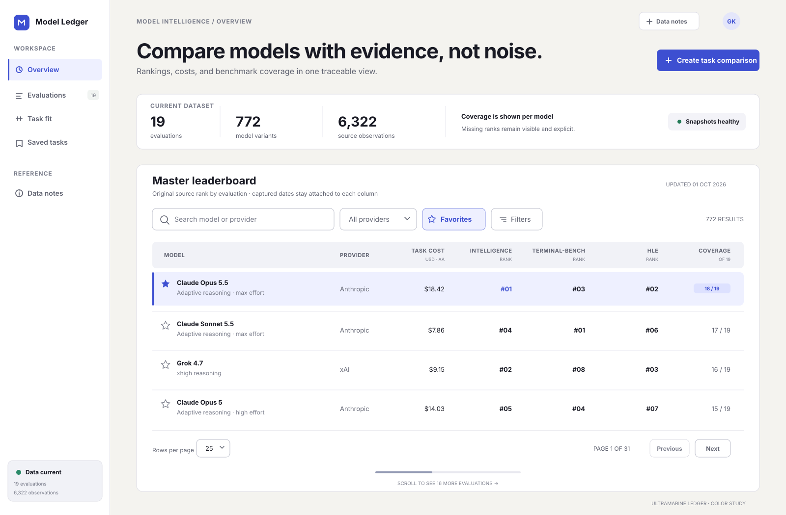

# Ultramarine Ledger

> The preferred light-only product direction for Model Benchmarks. It keeps the product’s comparison, filtering, ranking, favorites, task-planning, and provenance needs while replacing the legacy visual system.

## Visual preview

[Open the full-size visual](./visuals/ultramarine-ledger-overview.svg)

The preview uses representative product data to show hierarchy, density, color, control states, and table treatment. It is the approval target for the direction, not a final production screen or component specification.

## 1. Design Direction Name

**Ultramarine Ledger**

The name combines a precise, confident color with the structure and traceability of a research ledger. It gives the product a recognizable identity without making the interface decorative.

## 2. Visual Mood

- Calm analytical workspace with a precise, technical character.
- Warm limestone canvas balanced by crisp white working surfaces.
- Deep ultramarine signals action, selection, and current location.
- Editorial hierarchy around evidence, provenance, and comparison.
- Dense where users scan data; spacious where they make decisions.

## 3. Why This Direction Works

The current UI has useful accessibility foundations, but its hierarchy relies on many similar white cards, small type, repeated blue links, and locally defined spacing. Ultramarine Ledger gives each layer a clear job: the limestone canvas establishes place, the navigation rail establishes orientation, and one wide evidence sheet holds the active workflow. This reduces card-on-card clutter and gives the data view a deliberate visual center.

Ultramarine feels intelligent and exact, which suits a product used to assess AI models. The warmer canvas stops the palette from becoming cold or corporate, while near-black ink gives long tables and methodology content an editorial quality. Lavender selection states remain visible without overpowering the data. Semantic green, amber, and red are reserved for health, warning, and error states, so the brand accent never obscures meaning.

The layout scales across the product. The evidence sheet can become a leaderboard, task builder, saved-task library, comparison detail, or methodology article. A consistent toolbar, status strip, field language, and section rhythm can serve every major route.

## 4. Core Design Principles

1. **Evidence leads.** Place ranks, costs, coverage, sources, and capture dates close to the decision; keep introductory copy brief.
2. **One task, one working surface.** Use one dominant sheet per page. Add inset regions only when they clarify a step, state, or relationship.
3. **Dense data, generous framing.** Keep tables compact while giving page titles, summaries, and workflow boundaries more space.
4. **Accent communicates action or state.** Use ultramarine for primary actions, current navigation, selected rows, links, and focus.
5. **Keep context visible.** Preserve headers, model identity, active filters, result counts, and save state while users scan or scroll.
6. **Accessibility is visual quality.** Maintain strong contrast, 40–44px controls, visible focus, text labels for icons, and cues beyond color.

## 5. Visual Language Rules

- **Spacing density:** Use a 4px base scale. Page gaps are 32–48px, surface padding is 24–32px, control gaps are 8–12px, and table rows are 48–52px. Mobile gutters are 16px.
- **Surface treatment:** Use a warm limestone page canvas, white working sheets, and pale lavender-blue insets for selected or explanatory areas. Avoid nesting multiple bordered cards.
- **Borders and shadows:** Use 1px cool-neutral borders for structure. Reserve a soft shadow for floating menus and dialogs; normal sheets and cards remain flat.
- **Radius feel:** Use 12px for major sheets, 8px for controls and small interactive surfaces, and 6px for compact tags. Pills are reserved for status or removable filters.
- **Typography feel:** Use Geist for a crisp, modern UI, including ranks, costs, percentages, dates, and review comparisons. Use tabular figures when values need alignment. Headings are sentence case with tight tracking; labels are concise and medium weight.
- **Color usage:** Keep roughly 85% of the screen neutral. Ultramarine is the single brand and action color. Green, amber, and red appear only for success, warning, and error. Benchmark colors stay small and data-specific.
- **Iconography:** Use simple 18px outline icons with a consistent 1.75px stroke. Pair unfamiliar icons with text; avoid emoji as interface icons.
- **Motion:** Use 120–180ms ease-out transitions for hover, selection, disclosure, and route feedback. Avoid parallax, bouncing, decorative loading, and large page motion.
- **Visual noise:** Allow one strong heading, one primary action, and one dominant data region per viewport. Secondary actions become quiet buttons or text links.

## 6. Light Mode Visual Direction

- **Page background:** Limestone `#F4F3EF`, creating a warm frame around the working surfaces.
- **Surface background:** Pure white `#FFFFFF` for the active workflow and cool mist `#F1F2F7` for table headers or read-only regions.
- **Subtle backgrounds:** Lavender mist `#EEF0FF` for selection, active navigation, and informative callouts; warm sand `#F6F2E8` for warnings only.
- **Text hierarchy:** Primary ink `#191A24`; secondary slate `#606371`; tertiary `#7A7D8B`. Required labels and data never use tertiary text.
- **Borders:** Structural border `#DDDDE5`; stronger border `#BEC0CC` for control boundaries and hover. Section dividers replace extra containers.
- **Shadows:** No default card shadow. Floating surfaces use `0 12px 32px rgba(25, 26, 36, 0.12)`.
- **Accent:** Ultramarine `#3D4FD1`, with `#303FAF` for pressed states and white text on primary actions. Large tinted areas use lavender mist rather than translucent accent.
- **Selected, hover, and focus:** Selected items combine lavender fill, `#8995E5` border, and a 3px ultramarine leading marker. Hover uses `#F5F5FA`. Keyboard focus uses a 3px `#6675E8` ring with a 2px white offset. Table hover highlights the entire row while preserving sticky-cell backgrounds.
- **Semantic colors:** Health and success use `#237A57`; warning uses `#9A6200`; error uses `#B42318`. Pair each with text or an icon.

## 7. What the New Design Should Avoid

- Repeating identical white cards for headings, promotions, filters, and data.
- Default link blue, mixed brand accents, or decorative gradients.
- Small uppercase text as the primary hierarchy device; reserve it for short metadata.
- Unlabeled icon actions, emoji favorites, and subtle focus states.
- Control heights, corner radii, or spacing that change from route to route.
- Heavy shadows, glass effects, oversized pills, and floating panels without a functional reason.
- Dense paragraphs above tables, hidden provenance, or sorting labels that require guesswork.
- Horizontal table scrolling without a sticky identity column or visible scroll affordance.
- Color-only status, low-contrast secondary text, and disabled states represented only by opacity.
- Dark mode tokens, switches, previews, or implementation branches. Ultramarine Ledger is intentionally light mode only.

## Approval focus

Approve the direction based on four choices visible in the preview: the stable navigation rail, warm limestone canvas, ultramarine signal color, and single wide evidence sheet. After approval, the next step is a production-ready token set and responsive specifications for the master leaderboard, task planner, and saved-task library.
